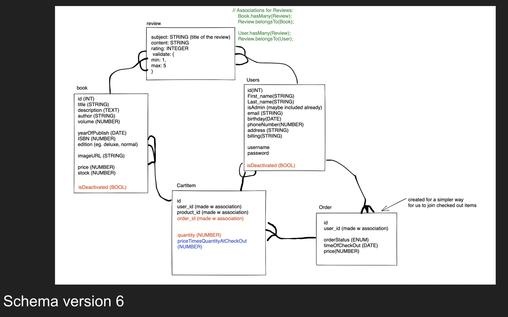
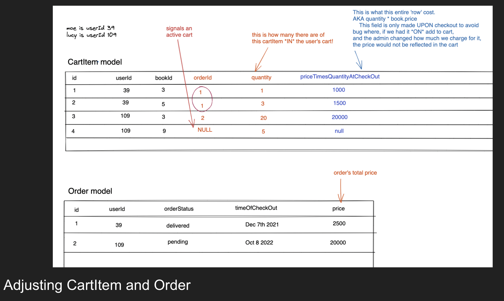

# What is this?
https://www.youtube.com/watch?v=rbbKldsF4Gw
Live Website: https://comic-overflow.onrender.com/
Comic Overflow is a basic e-commerce web application.

- You can browse & purchase comic books with an account
  - Items can be purchased using the integrated Stripe API.
- Items are categorized, and there is a way to see items by category
- If you have an account you can see your order history
- If you have an account your current shopping cart can be seen on multiple devices
- Adding items to your cart as a guest is allowed, and if you make an account, the items are transfered over.
- An admin is a special type of user with the ability to create new items for the store

# Basic Features

- A user should be able to see products
- A logged in user should be able to
  - see the items in their cart
  - add a new product to their cart
  - remove an item from their cart
  - create an order
- A user should be able to see their orders
- A user should be able to create an account
- A user should be able to see their past orders
- A non-logged in user should be able to add to their cart and have those items added to their cart after authenticating
- A user should be able to review a product
- A user should be able to update their profile
- An administrator should be able to add a new product

## How to get set up:

1. Visit our live deployment at https://comic-overflow.onrender.com/
2. Run it locally by git cloning this repo and running the following commands in the terminal:

```
$ createdb grace_shopper_db
$ npm i
$ npm run seed:dev
#npm run start:dev
```

And you're all set to start shopping!

## Images relevant to project planning & devlopment




## What are we hoping to do?

### COLLABORATION

This is your first real time working on a development team. To that end, you'll have to practice your social skills while maintaining your programming skills.

### SYNTHESIS

This project will touch on all of the things you've learned so far. To that end, it's a real test of your education up to this point as well as a great way to reinforce all of the content in the course.

### PLANNING

You'll have to act as an agile team. This means daily stand-ups / touch-bases, keeping a planning board, and using pull requests to modify the code base. On top of that you'll have to have code reviews and maintain a release schedule.

It will be important to use git and GitHub with a good workflow to prevent code problems. You'll have to review pull requests to make sure that the incoming code is safe and sanitary for the health of the code base.

It's hard work, but getting good at it makes sure that you're a good team member and a valuable asset to the project.

### BUILDING SOMETHING BIGGER

Up until now projects have felt relatively small in scope (even though they might have required enormous amounts of work). This project can be as big as you want, since there are no end to features you can add to an e-commerce site.
